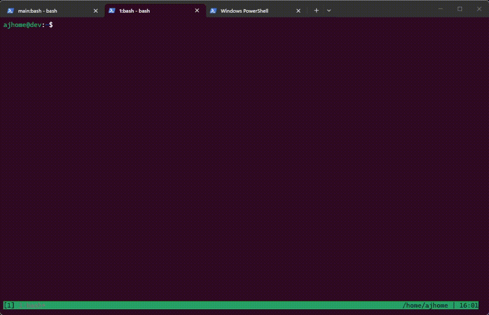

# bindfinder

```text
┌───────────────────────────────────────────────┐
│ bindfinder                                    │
│ terminal command palette for commands,        │
│ keybindings, cheatsheets, and shell snippets  │
└───────────────────────────────────────────────┘
```

`bindfinder` is a terminal-first command palette and cheatsheet browser for
developers. Search `tmux`, `git`, `docker`, `kubectl`, shell commands, and
navi cheatsheets, then insert the result straight back into your prompt.

It is built for keyboard-heavy terminal workflows: shell, SSH, tmux, and TUI
usage without leaving the terminal.

## Demo



## What It Does

- search commands, keybindings, and cheatsheets from one TUI
- browse built-in packs and imported navi/cheats repositories
- insert the selected command directly into your shell prompt
- fill command placeholders like `<branch>` or `<package>` inside the TUI
- work well in shell sessions, tmux, and remote terminal workflows

## Install

Recommended:

```bash
curl -fsSL https://github.com/younesehb/bindfinder/releases/latest/download/install.sh | sh
```

That installs the binary, installs the man page, writes the default config, and
sets up the shell integration automatically when it can detect your environment.
It also imports `denisidoro/cheats` by default when `git` is available.

Homebrew:

```bash
brew install younesehb/tap/bindfinder
```

Then:

```bash
bindfinder config
```

`bindfinder config` validates and reapplies the current integration automatically
when you exit the editor.

## Quickstart

### 3 Ways To Use bindfinder

1. Use the default shortcut
   - outside tmux: `Ctrl-]`
   - inside tmux: `prefix + ]`

2. Run the picker directly

```bash
bindfinder
```

3. Search directly from the CLI

```bash
bindfinder search tmux split
```

Type immediately to filter. Press `Enter` to insert the selected command.

Inside the picker:

- `bindfinder` opens the picker
- type to search
- `Enter` inserts the selected command
- `Esc` switches to normal mode
- `/` returns to search mode
- placeholder commands open a small argument form before insertion
- use your installed shortcut or just run `bindfinder`

Useful commands:

- `bindfinder doctor`: show the detected environment and the active opener
- `bindfinder reload`: rewrite and reapply shell/tmux integration
- `bindfinder update`: install the latest released version
- `bindfinder update --check`: check whether a newer version exists
- `bindfinder config`: open the config in your editor, then validate and reload it
- `bindfinder config validate`: validate the current config file explicitly
- `bindfinder navi import denisidoro/cheats`: import the main navi cheat repository
- `bindfinder uninstall`: remove the binary and managed integration blocks
- `bindfinder uninstall --purge-data`: also remove config, state, packs, repos, and cache files

Shell helpers:

- typing `bindfinder` with no arguments in an interactive shell now uses the shell-integrated picker path
- `bindfinder doctor` and other subcommands still go to the real binary
- `bf` is kept as a short alias for the same shell-integrated path
- the shell keybinding gives the best live in-prompt insertion flow

## Why People Use It

- faster than searching docs or old shell history for the same commands
- easier way to discover tmux keybindings, git commands, docker snippets, and shell workflows
- works like a developer command launcher without leaving the terminal

## Docs

- [Installation](./docs/install.md)
- [Configuration](./docs/config.md)
- [tmux integration](./docs/tmux.md)
- [navi support](./docs/navi.md)
- [Pack format](./docs/packs.md)
- [Release process](./docs/release.md)
- [Contributing](./CONTRIBUTING.md)

## Notes

- Linux and macOS are supported.
- The default experience is full-screen in the current terminal.
- tmux and terminal-specific overlays are optional enhancements.
- There are two launch keys in practice:
  - outside tmux: `Ctrl-]`
  - inside tmux: `prefix + ]`
- `integration.shell.binding` is the shell key.
- `integration.tmux.key` is the key after your tmux prefix.
- Prebuilt release automation currently targets Linux `x86_64` and macOS Apple Silicon. Intel macOS can still install from source with Cargo or Homebrew.
- bindfinder keeps the default man page installed automatically when you run it.
- `bindfinder install man --write` still exists as a manual fallback.
- The installer script downloads release artifacts from GitHub, installs into `~/.local` by default, and runs first-time setup unless `--no-setup` is used.
- If the current shell session does not pick up the integration immediately after install, reload that shell once.
- To remove bindfinder again, use `bindfinder uninstall`. Add `--purge-data` to also remove config, state, packs, repos, and cache files.
- The repository ships a Homebrew formula in [Formula/bindfinder.rb](./Formula/bindfinder.rb).

## Source Install

```bash
cargo install --path .
```
